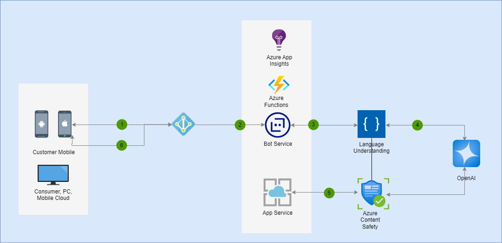
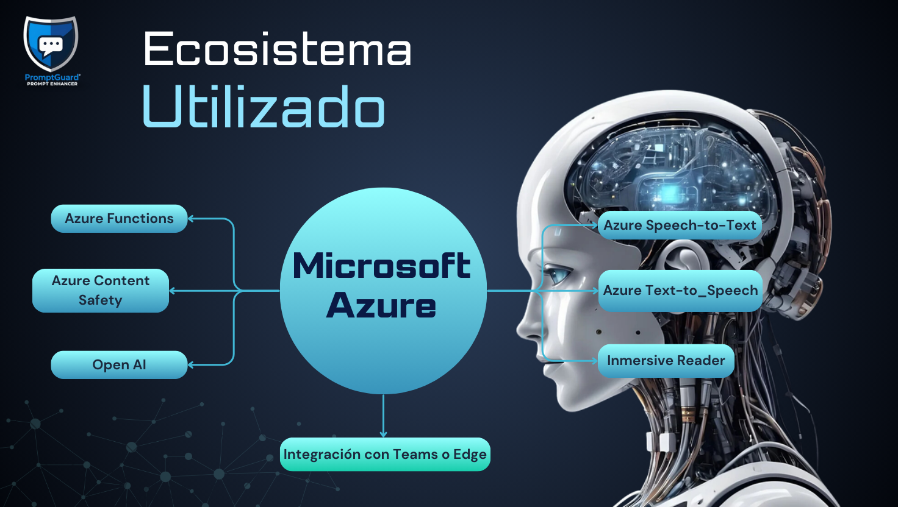

<div align="center">

# 🤖 Prompt Guard: 
# Sistema Inteligente de Validación de Prompts 
---


# Microsoft Innovation Challenge Marzo 2025  

</div>


<p align="center">
 
 
 
</p>


## 🎯 Objetivo
Diseñar un sistema de preprocesamiento de prompts que:
- Valide y corrija entradas antes de enviarlas a modelos de IA
- Optimice la calidad y seguridad de las generaciones
- Mitigue riesgos potenciales en la interacción con IA
  
<p align="center">
 


[WEB](https://frontend-pront-guard.vercel.app/)
</p>

## 🛡️ Características Principales
- Corrección gramatical automática
- Detección de lenguaje dañino o inapropiado
- Evaluación de sesgos y contenido sensible
- Mejora de la claridad y precisión de prompts

## 🏗️ Arquitectura
- **Backend:** Azure Functions
- **Servicios de Seguridad:** 
  * Azure Content Safety
  * OpenAI (Modelo GPT para mejora de prompts)
- **Procesamiento de Lenguaje:** 
  * spaCy
  * TextBlob

 <p align="center">
 


</p>

## 🔒 Componentes de Seguridad
- Análisis de riesgos de contenido
- Filtrado de lenguaje inapropiado
- Sugerencias de alternativas éticas y constructivas
---
<p align="center">
 


</p>

## **Demo Video**

[](https://youtu.be/2oxRFpunyTo)

## ⚙️ **Configuración Paso a Paso**  


### 1️⃣ **Crear escenario en Python/local**
- Crear proyecto de Functions
```

func init myFunctionApp --worker-runtime python
```
- Entrar al directorio
```
cd myFunctionApp
```
- Debe quedar esta estructura: 
```
myFunctionApp/
├── function_app.py
├── host.json
├── local.settings.json
└── requirements.txt
```
### 2️⃣ **Actualizamos el Homebrew (solo para Linux/Mac) e instalamos CLI y CORE TOOLS de Azure**
- Instalar Azure CLI
```

brew update
brew install azure-cli
```
- Instalar Azure Functions Core Tools
```
brew tap azure/functions
```
- Linux/Mac:
```
brew install azure-functions-core-tools@4 
```
- Windows:
```
npm install -g azure-functions-core-tools@4 #Windows
choco install azure-functions-core-tools-4  # considerar también si usa Chocolatey
```
- Verificar instalaciones
```
az --version
func --version
```
### 3️⃣ **Completamos los archivos:**

1. Codigo en `function_app.py`:
```
import azure.functions as func
import logging
import json
import re
import random

app = func.FunctionApp()

def contains_inappropriate_language(prompt):
    inappropriate_words = [
        'mierda', 'idiota', 'estúpido', 'imbécil', 
        'pendejo', 'hijo de puta', 'gilipollas'
    ]
    
    prompt_lower = prompt.lower()
    
    for word in inappropriate_words:
        if word in prompt_lower:
            return True
    
    return False

def detect_prompt_intention(prompt):
    """
    Análisis más detallado de la intención del prompt
    """
    intention_patterns = {
        'learning': [
            r'\b(aprender|explicar|entender|comprender)\b',
            r'\b(cómo funciona|qué es|significado)\b'
        ],
        'problem_solving': [
            r'\b(resolver|ayuda|solución|problema|diagnosticar)\b',
            r'\b(cómo puedo|qué debo hacer)\b'
        ],
        'creative': [
            r'\b(imaginar|crear|diseñar|inventar|proponer)\b',
            r'\b(nueva idea|innovación|concepto)\b'
        ],
        'analytical': [
            r'\b(analizar|investigar|estudiar|examinar)\b',
            r'\b(impacto|consecuencias|desarrollo)\b'
        ],
        'technical': [
            r'\b(algoritmo|inteligencia artificial|machine learning|tecnología)\b',
            r'\b(programación|código|sistema|computación)\b'
        ]
    }
    
    detected_intentions = []
    
    for intention, patterns in intention_patterns.items():
        for pattern in patterns:
            if re.search(pattern, prompt.lower()):
                detected_intentions.append(intention)
                break
    
    return detected_intentions if detected_intentions else ['general']

def detect_context_and_improve(prompt):
    """
    Detecta el contexto del prompt
    """
    context_patterns = {
        'learning': [
            r'\b(explicame|qué es|cómo funciona)\b',
            r'\b(entender|comprender)\b'
        ],
        'problem_solving': [
            r'\b(resolver|problema|ayuda|solución)\b',
            r'\b(cómo puedo|qué debo hacer)\b'
        ],
        'creative': [
            r'\b(imagina|crea|diseña|inventa|propón)\b',
            r'\b(nueva idea|innovación|concepto)\b'
        ],
        'technical': [
            r'\b(tecnología|algoritmo|sistema|método)\b',
            r'\b(desarrollo|implementación)\b'
        ]
    }
    
    for context, patterns in context_patterns.items():
        for pattern in patterns:
            if re.search(pattern, prompt.lower()):
                return context
    
    return 'general'

def analyze_prompt_complexity(prompt):
    """
    Analiza la complejidad y profundidad del prompt
    """
    # Métricas de complejidad
    word_count = len(prompt.split())
    unique_words = len(set(prompt.lower().split()))
    
    # Detección de palabras técnicas o especializadas
    technical_words = [
        'algoritmo', 'inteligencia', 'machine learning', 
        'neural', 'computacional', 'cuántico', 'blockchain'
    ]
    
    technical_word_count = sum(1 for word in technical_words if word in prompt.lower())
    
    # Clasificación de complejidad
    complexity_level = 'basic'
    if word_count > 10 and unique_words > 8:
        complexity_level = 'intermediate'
    if technical_word_count > 0 or word_count > 15:
        complexity_level = 'advanced'
    
    # Análisis de profundidad
    depth_indicators = {
        'basic': ['simple', 'general', 'introducción'],
        'intermediate': ['detallado', 'explicación', 'análisis'],
        'advanced': ['profundo', 'complejo', 'especializado']
    }
    
    depth = random.choice(depth_indicators[complexity_level])
    
    return {
        'word_count': word_count,
        'unique_words': unique_words,
        'technical_words': technical_word_count,
        'complexity_level': complexity_level,
        'depth': depth
    }

def generate_improvement_suggestions(intentions, context, complexity=None):
    """
    Genera sugerencias de mejora basadas en la intención, contexto y complejidad
    """
    suggestion_templates = {
        'learning': [
            "Profundice en los conceptos fundamentales.",
            "Considere incluir ejemplos prácticos para una mejor comprensión."
        ],
        'problem_solving': [
            "Proporcione más detalles sobre el contexto del problema.",
            "Incluya información sobre los recursos o herramientas disponibles."
        ],
        'creative': [
            "Explore límites y restricciones para guiar la creatividad.",
            "Considere el impacto potencial de su idea innovadora."
        ],
        'technical': [
            "Especifique el nivel de conocimiento técnico requerido.",
            "Considere el ecosistema tecnológico relevante."
        ],
        'general': [
            "Sea más específico en su solicitud.",
            "Proporcione contexto adicional para una mejor comprensión."
        ]
    }
    
    # Combinar sugerencias basadas en intenciones y contexto
    suggestions = []
    for intention in intentions:
        if intention in suggestion_templates:
            suggestions.extend(
                random.sample(suggestion_templates[intention], 
                              min(1, len(suggestion_templates[intention])))
            )
    
    # Sugerencias basadas en complejidad
    if complexity:
        if complexity.get('complexity_level') == 'basic':
            suggestions.append("Considere expandir su prompt para obtener información más detallada.")
        elif complexity.get('complexity_level') == 'advanced':
            suggestions.append("Su prompt parece ser muy técnico. Asegúrese de que la audiencia comprenderá la terminología.")
    
    return suggestions

@app.route(route="preprocess_prompt", methods=["POST"])
def preprocess_prompt_endpoint(req: func.HttpRequest) -> func.HttpResponse:
    try:
        req_body = req.get_json()
        prompt = req_body.get('prompt', '')
        
        if not prompt:
            return func.HttpResponse(
                json.dumps({"error": "Prompt vacío"}),
                status_code=400,
                mimetype="application/json"
            )
        
        # Inicializar resultado
        result = {
            'original_prompt': prompt,
            'processed_prompt': prompt,
            'issues': [],
            'suggestions': [],
            'risk_level': 'low',
            'intention': None,
            'context': None,
            'complexity': None
        }
        
        # Validación de longitud
        if len(prompt) < 5:
            result['issues'].append('short_prompt')
            result['suggestions'].append(
                'El prompt es demasiado corto. Por favor, proporcione más contexto.'
            )
        
        # Validación de lenguaje inapropiado
        if contains_inappropriate_language(prompt):
            result['issues'].append('inappropriate_language')
            result['suggestions'].append(
                'Se detectaron palabras inapropiadas. Por favor, use un lenguaje respetuoso.'
            )
            result['risk_level'] = 'high'
        
        # Detección de intención
        intentions = detect_prompt_intention(prompt)
        result['intention'] = intentions
        
        # Detección de contexto
        context = detect_context_and_improve(prompt)
        result['context'] = context
        
        # Análisis de complejidad
        complexity_analysis = analyze_prompt_complexity(prompt)
        result['complexity'] = complexity_analysis
        
        # Generar sugerencias de mejora
        improvement_suggestions = generate_improvement_suggestions(
            intentions, 
            context,
            result['complexity']
        )
        result['suggestions'].extend(improvement_suggestions)
        
        return func.HttpResponse(
            json.dumps(result),
            status_code=200,
            mimetype="application/json"
        )
    
    except Exception as e:
        logging.error(f"Error en procesamiento: {str(e)}")
        return func.HttpResponse(
            json.dumps({"error": str(e)}),
            status_code=500,
            mimetype="application/json"
        )
```
### **Acciones:**

- Verifica si el prompt contiene lenguaje inapropiado.
- Detecta la intención del prompt.
- Identifica el contexto del prompt.
- Analiza la complejidad del prompt.
- Genera sugerencias de mejora.
- Asigna un nivel de riesgo basado en el contenido del prompt.


2. Archivo `requirements.txt`:
```
azure-functions
textblob
openai
python-dotenv
```

3. Archivo `host.json`:
```
{
  "version": "2.0",
  "logging": {
      "applicationInsights": {
          "samplingSettings": {
              "isEnabled": true,
              "excludedTypes": "Request"
          }
      }
  },
  "extensionBundle": {
      "id": "Microsoft.Azure.Functions.ExtensionBundle",
      "version": "[3.*, 4.0.0)"
  }
}
```
4. Archivo `local.settings.json`:
```
{
    "IsEncrypted": false,
    "Values": {
        "AzureWebJobsStorage": "",
        "FUNCTIONS_WORKER_RUNTIME": "python",
        "OPENAI_API_KEY": "tu_clave_de_openai",
        "AZURE_CONTENT_SAFETY_ENDPOINT": "tu_endpoint_de_content_safety",
        "AZURE_CONTENT_SAFETY_KEY": "tu_clave_de_content_safety",
       
    }
}
```
5. Agregarle al archivo `.gitignore`: 
```

*.pyc

```
### 4️⃣ **Crear Azure Function App**  
💡 **Función principal donde correrá nuestra validación.**  

1. Iniciar sesión en Azure: 
```
az login
```
2. Crear recursos de Azure: 
### **Nota importante**:
En éste laboratorio, **<u>Codigo Facilito</u>** ha tenido la amabilidad de ofrecer una plataforma de trabajo en la que, al ingresar, el grupo de recurso **"equipo3"** ya estaba asignado. Por lo tanto, en **este Hackathon particular** éste paso puede omitirse. 
- Crear grupo de recursos
- Añadir región como variable, elegimos 'eastus2' ya que soporta el plan flex-consumption(y dentro de él tenemos python)
```
REGION="centralus"
az group create --name <El_nombre_que_quieras_dar> --location $REGION
```
```

# Crear cuenta de storage (requerida para Functions)
STORAGE_ACCOUNT="almacenhackathonmarzo2"
az storage account create \
    --name $STORAGE_ACCOUNT \
    --location $REGION \
    --resource-group MyPythonFunctionsGroup \
    --sku Standard_LRS

```
- A veces hay demasiada latencia y no nos permite continuar con los scripts ya que no llegan a crearse las instancias en el portal, para que ello no suceda, he aqui un scrip que esperará dinamicamente que la cuenta de almacenamiento esté disponible:
```
echo "Verificando la cuenta de almacenamiento..."
while ! az storage account show --name $STORAGE_ACCOUNT --resource-group MyPythonFunctionsGroup &>/dev/null; do
    echo "Esperando a que la cuenta de almacenamiento esté disponible..."
    sleep 10
done
echo "Cuenta de almacenamiento detectada, continuando..."
```
- Crear el plan de consumo Flex Consumption que, como ya dijimos mas arriba es el que soporta Python
```

az functionapp plan create \
    --resource-group equipo3 \
    --name my-flex-consumption-plan \
    --location centralus \
    --sku EP1 \
    --is-linux
```
- Crear Function App
```
az functionapp create \
    --resource-group equipo3 \
    --plan my-flex-consumption-plan \
    --os-type Linux \
    --runtime python \
    --runtime-version 3.9 \
    --functions-version 4 \
    --name functionforhackmar25 \
    --storage-account $STORAGE_ACCOUNT
```
3. Verificacion:
```
az functionapp list --resource-group equipo3 --query "[].{Name:name, Runtime:siteConfig.linuxFxVersion, OS:reserved}"
```
- Este comando deberia devolver: 
```
[
  {
    "Name": "functionforhackmar25",
    "OS": true,
    "Runtime": "Python|3.9"
  }
]
```

### 5️⃣ **Continuar trabajando en local:**
1. Crear entorno virtual para la posterior prueba local, si fuera necesario:
- Antes de activar, asegurarse de tener la última versión de pip
```
python -m pip install --upgrade pip
```
- Crear entorno en Python 3.9, en este caso se instalará usando "pyenv"
```
pyenv install 3.9.21
```
- Paso a seguir:
```
python -m venv venv
```
- Activar en (windows):
```
.\venv\Scripts\activate
```
- Activar en Linux/Mac:
```
source venv/bin/activate
```
- Instalar dependencias
```
pip install -r requirements.txt
```

2. Probar localmente:
```
func start
```
3. Para probar de forma local si está funcionando bien, podemos hacer estas consultas `curl`
- Prueba básica con un prompt válido: 
```
curl -X POST "http://localhost:7071/api/preprocess_prompt" \
     -H "Content-Type: application/json" \
     -d '{"prompt": "¿Cómo funciona un algoritmo de machine learning?"}'
```
- Respuesta esperada:
```
{"original_prompt": "\u00bfC\u00f3mo funciona un algoritmo de machine learning?", "processed_prompt": "\u00bfC\u00f3mo funciona un algoritmo de machine learning?", "issues": [], "suggestions": ["Profundice en los conceptos fundamentales.", "Considere el ecosistema tecnol\u00f3gico relevante.", "Su prompt parece ser muy t\u00e9cnico. Aseg\u00farese de que la audiencia comprender\u00e1 la terminolog\u00eda."], "risk_level": "low", "intention": ["learning", "technical"], "context": "learning", "complexity": {"word_count": 7, "unique_words": 7, "technical_words": 2, "complexity_level": "advanced", "depth": "profundo"}}%  
```
- Prueba con un Prompt corto: 
```
curl -X POST "http://localhost:7071/api/preprocess_prompt" \
     -H "Content-Type: application/json" \
     -d '{"prompt": "Hola"}'
```
- Respuesta esperada: 
```
{"original_prompt": "Hola", "processed_prompt": "Hola", "issues": ["short_prompt"], "suggestions": ["El prompt es demasiado corto. Por favor, proporcione m\u00e1s contexto.", "Proporcione contexto adicional para una mejor comprensi\u00f3n.", "Considere expandir su prompt para obtener informaci\u00f3n m\u00e1s detallada."], "risk_level": "low", "intention": ["general"], "context": "general", "complexity": {"word_count": 1, "unique_words": 1, "technical_words": 0, "complexity_level": "basic", "depth": "general"}}
```
- Prueba con un prompt que contiene lenguaje inapropiado: 
```
curl -X POST "http://localhost:7071/api/preprocess_prompt" \
     -H "Content-Type: application/json" \
     -d '{"prompt": "Esto es una mierda, no sirve"}'
```
- Respuesta esperada: 
```
{"original_prompt": "Esto es una mierda, no sirve", "processed_prompt": "Esto es una mierda, no sirve", "issues": ["inappropriate_language"], "suggestions": ["Se detectaron palabras inapropiadas. Por favor, use un lenguaje respetuoso.", "Sea m\u00e1s espec\u00edfico en su solicitud.", "Considere expandir su prompt para obtener informaci\u00f3n m\u00e1s detallada."], "risk_level": "high", "intention": ["general"], "context": "general", "complexity": {"word_count": 6, "unique_words": 6, "technical_words": 0, "complexity_level": "basic", "depth": "introducci\u00f3n"}}%        
```
- Prueba con un prompt técnico avanzado:
```
curl -X POST "http://localhost:7071/api/preprocess_prompt" \
     -H "Content-Type: application/json" \
     -d '{"prompt": "Explícame cómo se implementa un modelo de redes neuronales convolucionales en Python"}'
```
- Respuesta esperada: 
```
{"original_prompt": "Expl\u00edcame c\u00f3mo se implementa un modelo de redes neuronales convolucionales en Python", "processed_prompt": "Expl\u00edcame c\u00f3mo se implementa un modelo de redes neuronales convolucionales en Python", "issues": [], "suggestions": ["Proporcione contexto adicional para una mejor comprensi\u00f3n."], "risk_level": "low", "intention": ["general"], "context": "general", "complexity": {"word_count": 12, "unique_words": 12, "technical_words": 0, "complexity_level": "intermediate", "depth": "explicaci\u00f3n"}}%  
```
- Prueba con un prompt vacío:
```
curl -X POST "http://localhost:7071/api/preprocess_prompt" \
     -H "Content-Type: application/json" \
     -d '{"prompt": ""}'
```
- Respuesta esperada: 
```
{"error": "Prompt vac\u00edo"}%  
```
- Prueba con un prompt creativo:
```
curl -X POST "http://localhost:7071/api/preprocess_prompt" \
     -H "Content-Type: application/json" \
     -d '{"prompt": "Diseña un nuevo sistema de recomendación de música basado en emociones"}'
```
- Respuesta esperada: 
```
{"original_prompt": "Dise\u00f1a un nuevo sistema de recomendaci\u00f3n de m\u00fasica basado en emociones", "processed_prompt": "Dise\u00f1a un nuevo sistema de recomendaci\u00f3n de m\u00fasica basado en emociones", "issues": [], "suggestions": ["Especifique el nivel de conocimiento t\u00e9cnico requerido."], "risk_level": "low", "intention": ["technical"], "context": "creative", "complexity": {"word_count": 11, "unique_words": 10, "technical_words": 0, "complexity_level": "intermediate", "depth": "detallado"}}%  
```


### 6️⃣ **Desplegar en Azure:**
- Publicar Function App
```
func azure functionapp publish functionforhackmar25
```
- Tambien se podria añadir flag para mostrar mas detalles:
```
func azure functionapp publish functionforhackmar25 --verbose (opcional)
```
- Verificar el deployment:
```
az functionapp show --name functionforhackmar25 --resource-group equipo3
```
- En la pestaña CORS (function -> API -> CORS)se aconseja **<ins>no clickear</ins>** sobre "<ins>Habilitar Access-Control-Allow-Credentials</ins>" y colocar estas direcciones en 'Origenes permitidos':
```
https://portal.azure.com
https://localhost:3000
```


- Obtener la URL de la API desplegada:
```
az functionapp list --query "[].{Name:name, DefaultHostName:defaultHostName}" --output table
```
## 🔹 **Autenticación y Obtención del Código de Acceso**
En éste laboratorio, Azure Functions puede requerir una clave de acceso (`code`) si el `authLevel` no está configurado como `"anonymous"`.  
Para obtener esta clave, puedes ejecutar el siguiente comando en **Azure CLI**:

```sh
az functionapp keys list --name functionforhackmar25 --resource-group equipo3 --query "functionKeys.default" --output tsv
```

Una vez obtenida la clave, se debe agregar a las solicitudes a la API como un parámetro en la URL:

```
curl -X POST "https://functionforhackmar25.azurewebsites.net/api/preprocess_prompt?code=<LA_CLAVE_OBTENIDA>" \
     -H "Content-Type: application/json" \                                                       
     -d '{"prompt": "¿Cómo funciona un algoritmo de machine learning?"}'                   
```

Si en el futuro la autenticación se configura como `"anonymous"`, este parámetro ya no será necesario.

---


<p align="center">
 


</p>


- [Luis Alberto Cerelli](https://www.linkedin.com/in/luis-cerelli/)
- [Edgar Camilo Guerrero](https://www.linkedin.com/in/edgar-guerrero9606/)
- [Maria Jimena Fioni](https://www.linkedin.com/in/jimena-fioni/)
- [Cristian Paez](https://www.linkedin.com/in/cristian009/)
- [Henry Suarez Lazarte](https://www.linkedin.com/in/henry-angel-suarez-lazarte/)
